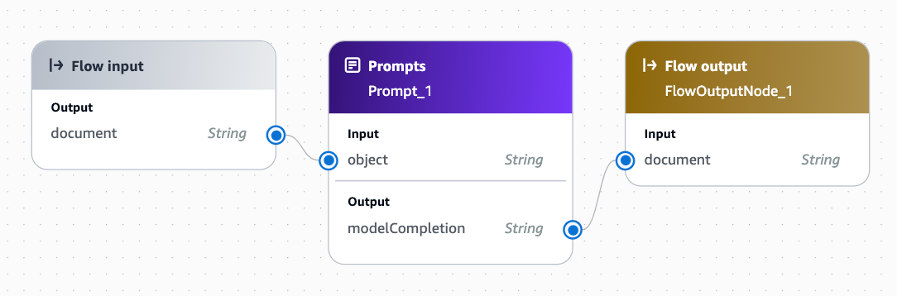

# 🚀 Text-to-MySQL Converter

<div align="center">


Harness the power of AWS Bedrock AI to convert natural language into SQL that can be run against the included MySQL database.


[Features](#features) •
[Getting Started](#getting-started) •
[Usage](#usage) •
[Technologies](#technologies) •
[Contributing](#contributing)

</div>

## ✨ Features

- 🗣️ Convert natural language questions to SQL queries
- 🎯 Real-time query execution
- 🎨 Clean and intuitive user interface
- ⚡ Instant database results
- 🔄 Auto-run SQL option
- 🎚️ Toggle SQL visibility
- 📋 Clear and organized result display

## 🚀 Getting Started

### Prerequisites

- [Docker](https://www.docker.com/) - Accelerated container application development
- [AWS Bedrock](https://aws.amazon.com/bedrock/) - A fully managed service for building AI applications with foundation models

### Installation

1. Clone the repository

```sh 
   git clone https://github.com/LibertySource/text-to-mysql.git
```

2. Navigate to the project directory

```sh
   cd text-to-mysql 
```

3. Set up your AWS credentials (refer to AWS documentation)

4. Create an AWS Bedrock Prompt similiar to the following

[TODO]

5. Create AWS Bedrock Prompt Flow to use above prompt



6. Copy .env-sample to .env and populate values 

## 🖥️ Usage

Run the application using Docker:  

```sh
docker compose up --build
```

Once the container has been built and started open the application in a webrowser at [http://localhost:8000](http://localhost:8000)

## 🤝 Contributing

Contributions are what make the open-source community such an amazing place to learn, inspire, and create. Any contributions you make are **greatly appreciated**.

1. Fork the Project
2. Create your Feature Branch (`git checkout -b feature/AmazingFeature`)
3. Commit your Changes (`git commit -m 'Add some AmazingFeature'`)
4. Push to the Branch (`git push origin feature/AmazingFeature`)
5. Open a Pull Request

## 📜 License

Distributed under the MIT License. See `LICENSE` for more information.

## 📞 Contact

Jeff Holst - jeff@libertysource.com  

Project Link: [https://github.com/LibertySource/text-to-mysql](https://github.com/LibertySource/text-to-mysql)

## 🙏 Acknowledgments

- [AWS Bedrock Documentation](https://docs.aws.amazon.com/bedrock/)
- [Deno Documentation](https://deno.land/manual)
- [Docker Documentation](https://www.docker.com/get-started/)
- [Choose an Open Source License](https://choosealicense.com)